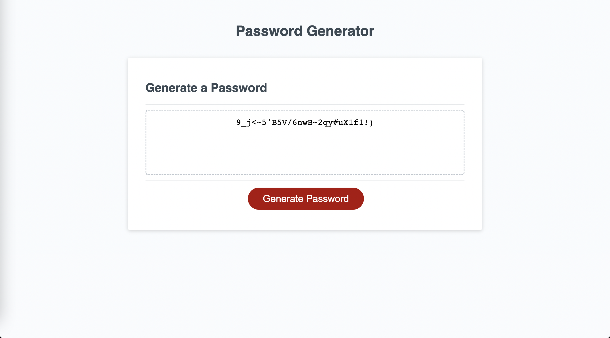
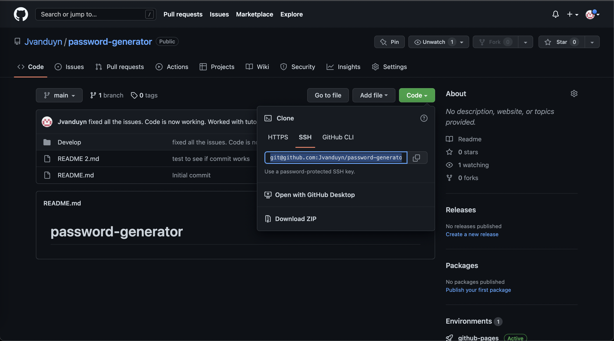

# password-generator

## Description

During this project, I wanted to be able to put my Javascript skills to the test. This web app will allow users to generate a random password using the criteria that fits them. They will be walked through a series of promts that will intake the users criteria, and generate a password in less than a second. 

- My motivation for this project was to be able to put some of my Javascript skills into on larger scale project. This could allow other people to see the work I have been doing for themselves. 
- I built this project because I wanted to have anyone be able to use an easy to use project that I built. 
- This will solve any problem of any user to create a secure password.
- During this project I learned how to be able to impliment different practices into one large function and be able to pass that information and store it into an array. 

## Installation

- In order to see the website live, you can follow this link. https://jvanduyn.github.io/Secure-passwords/

- If you wish to view the code, please visit my Github repository. https://github.com/Jvanduyn/password-generator. 

- If you wish to install the code, you must click on the large green button that displays "Code". From there you will copy this link under the SSH key (git@github.com:Jvanduyn/password-generator.git).

- You will then need to open your operating systems terminal and type "git clone git@github.com:Jvanduyn/password-generator.git". From there you will need to type "cd password-generator". Lastly you will need to type the phrase "code .". You now have access to the repository! Below is a screen shot of the repository as well as the live website. 

## Usage

## Credits

During this project, I collaborated with two people I would like to thank. 

First I collaborated with my fellow classmate Alexander. He and I were able to get most of the project working together minus a few bugs with the password length requirements.

Lastly I was able to work with a tutor of mine Vinnie Lopez. He was able to really help me polish the project off by getting the code working perfectly, and being able to consolidate most of the code to make it functioning properly.

## Features

This project allows a user to generate a password using the requirements the user selects and displays said password into the text box on the website. 

The user has the option to chose the following 
- Password character length
- If it uses uppercase letters
- If it uses lowercase letters
- If it has any numbers
- If there is any special characters. 

## Contact
If you wish to contact me, you can reach me at both my email and my github site. 
- jcvanduyn@yahoo.com
- https://github.com/Jvanduyn